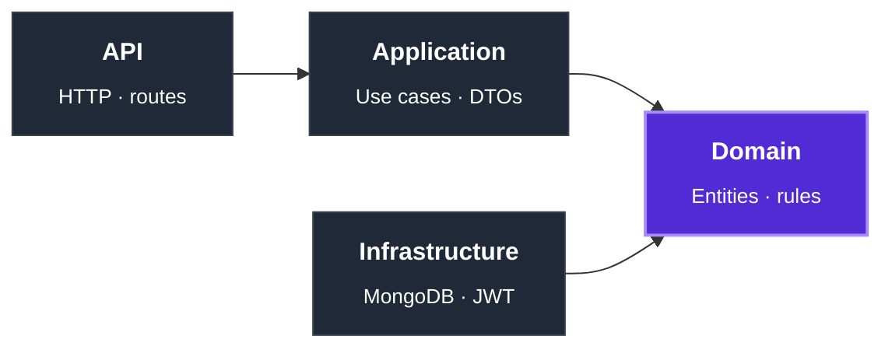

<!-- ============================================================ -->
<!--                         HEADER                                -->
<!-- ============================================================ -->

  

  <i>Building regulated, high-availability systems for the Brazilian public health sector.</i>

  
  &nbsp;
  
  &nbsp;
  
  &nbsp;
  

 

---

## About

Three years of production experience in the .NET ecosystem. My day-to-day is designing modular monoliths that serve health-surveillance regulatory workflows for state government — systems where domain correctness, traceability, and auditability matter more than novelty.

I default to **Clean Architecture**, **Domain-Driven Design**, and **CQRS** where they earn their place. Unit and integration tests are part of *done*, not an afterthought.

Open to remote backend roles aligned with **EU**, **UK**, or **US Eastern** time zones.

---

## Core Expertise

<table align="center">
  <tr>
    <td align="center" valign="top" width="240">
      <b>Core</b>
        
      
      &nbsp;&nbsp;
      
        
      C# · .NET 8 · ASP.NET Core · EF Core
    </td>
    <td align="center" valign="top" width="240">
      <b>Data</b>
        
      
      &nbsp;&nbsp;
      
      &nbsp;&nbsp;
      
        
      SQL Server · PostgreSQL · MongoDB
    </td>
    <td align="center" valign="top" width="240">
      <b>Infra</b>
        
      
      &nbsp;&nbsp;
      
      &nbsp;&nbsp;
      
        
      Docker · Jenkins · Git · IIS / Windows Server
    </td>
  </tr>
</table>

  <b>Practices</b> &nbsp;·&nbsp; Clean Architecture &nbsp;·&nbsp; DDD &nbsp;·&nbsp; CQRS &nbsp;·&nbsp; SOLID &nbsp;·&nbsp; xUnit &nbsp;·&nbsp; integration testing
   
  <b>Currently exploring</b> &nbsp;·&nbsp; distributed systems &nbsp;·&nbsp; system design at scale &nbsp;·&nbsp; observability patterns

---

## Engineering Principles

> *Architecture is the set of constraints I impose now to make change easier later.*

- **Dependency direction matters more than folder structure.** Layers are a side effect; the real rule is that the Domain depends on nothing — everything else is consequence.
- **Misconfiguration in production is silent until it isn't.** I validate options at startup. The app either boots correctly, or it crashes loudly. There is no third state.
- **Tests aren't a quality gate. They are a contract with future-me** — the engineer who has forgotten how this works six months from now.
- **A modular monolith ships faster than a half-baked microservice.** Distribution is a cost, not a feature. I make it a deliberate choice, never a default.
- **Logs are an API for your future self under stress.** Structure them, name them, treat breaking changes seriously.

---

## Currently Building

### [AegisIdentity](https://github.com/KauaVilasBoas/AegisIdentity) &nbsp;·&nbsp; Identity & Authentication service in .NET 8

> A portfolio piece built to demonstrate end-to-end architectural decisions on a non-trivial domain — not just "another auth API".

| Decision | Rationale |
|---|---|
| **Clean Architecture, strict layer rules** | `Api → Application → Domain ← Infrastructure`. Domain has zero external dependencies. |
| **Central Package Management** | Single source of truth for versions across the entire solution. |
| **`TreatWarningsAsErrors` enabled** | Compiler-enforced quality bar. No "we'll clean it up later". |
| **Startup-time options validation** | `ValidateDataAnnotations().ValidateOnStart()` — misconfigurations crash on boot, never silently in production. |
| **JWT + MongoDB + Razor Pages backoffice** | Real authentication flow plus administrative UI — not a textbook example. |
| **xUnit + integration tests** | Tests as a first-class deliverable. |

  
  &nbsp;
  
  &nbsp;
  
  &nbsp;
  
  &nbsp;
  

---

## Dashboard

  
  &nbsp;
  

  
  &nbsp;
  

---

## Connect

  
  &nbsp;
  
  &nbsp;
  

  

