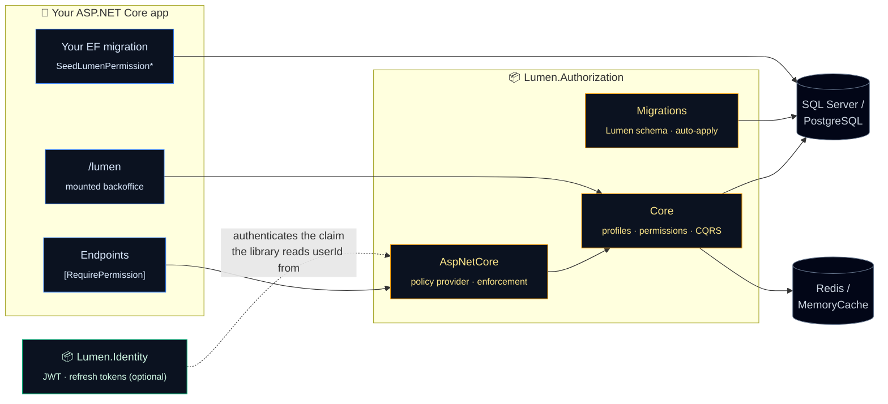

<!-- ============================================================ -->
<!--                         HEADER                                -->
<!-- ============================================================ -->

  

  <i>Building regulated, high-availability systems for the Brazilian public health sector — and shipping the reusable pieces to NuGet.</i>

  
  &nbsp;
  
  &nbsp;
  
  &nbsp;
  
  &nbsp;
  

 

---

## About

Three years of production experience in the .NET ecosystem. My day-to-day is designing modular monoliths that serve health-surveillance regulatory workflows for state government — systems where domain correctness, traceability, and auditability matter more than novelty.

Outside of work I maintain **[Lumen](https://github.com/KauaVilasBoas/Lumen)**, a family of authorization and identity libraries for ASP.NET Core published on NuGet. It isn't a demo repository: it's versioned independently, documented with ADRs, and consumed in production by a multi-tenant laboratory system serving a real pharmacology lab. Having a real consumer is what keeps it honest — every generic API in it was paid for by a concrete requirement, not invented in a vacuum.

I default to **Clean Architecture**, **Domain-Driven Design**, and **CQRS** where they earn their place. Unit and integration tests are part of *done*, not an afterthought.

Open to remote backend roles aligned with **EU**, **UK**, or **US Eastern** time zones.

---

## Core Expertise

<table align="center">
  <tr>
    <td align="center" valign="top" width="240">
      <b>Core</b>
        
      
      &nbsp;&nbsp;
      
        
      C# · .NET 8 · ASP.NET Core · EF Core · Dapper
    </td>
    <td align="center" valign="top" width="240">
      <b>Data</b>
        
      
      &nbsp;&nbsp;
      
      &nbsp;&nbsp;
      
        
      SQL Server · PostgreSQL · MongoDB · Redis
    </td>
    <td align="center" valign="top" width="240">
      <b>Infra</b>
        
      
      &nbsp;&nbsp;
      
      &nbsp;&nbsp;
      
        
      Docker · Terraform · AWS · Jenkins · GitHub Actions
    </td>
  </tr>
</table>

  <b>Practices</b> &nbsp;·&nbsp; Clean Architecture &nbsp;·&nbsp; DDD &nbsp;·&nbsp; CQRS &nbsp;·&nbsp; Outbox &nbsp;·&nbsp; SOLID &nbsp;·&nbsp; xUnit &nbsp;·&nbsp; Testcontainers &nbsp;·&nbsp; architecture testing
   
  <b>Currently exploring</b> &nbsp;·&nbsp; distributed systems &nbsp;·&nbsp; system design at scale &nbsp;·&nbsp; observability patterns

---

## Engineering Principles

> *Architecture is the set of constraints I impose now to make change easier later.*

- **Dependency direction matters more than folder structure.** Layers are a side effect; the real rule is that the Domain depends on nothing — everything else is consequence.
- **If a boundary isn't tested, it doesn't exist.** Module isolation and dependency rules are asserted by NetArchTest/ArchUnit suites that fail the build. Documentation drifts; a red test doesn't.
- **A library earns its abstractions from a real consumer.** Generic APIs invented in a vacuum are guesses. Every extension point in Lumen exists because a shipping system needed it — and I wrote down *why* in an ADR.
- **Adding a package must never change existing behaviour.** A library that silently enforces something on install is a library you can't adopt incrementally.
- **Misconfiguration in production is silent until it isn't.** I validate options at startup. The app either boots correctly, or it crashes loudly. There is no third state.
- **A modular monolith ships faster than a half-baked microservice.** Distribution is a cost, not a feature. I make it a deliberate choice, never a default.
- **Logs are an API for your future self under stress.** Structure them, name them, treat breaking changes seriously.

---

## Currently Building

### [Lumen](https://github.com/KauaVilasBoas/Lumen) &nbsp;·&nbsp; Plug-in authorization & identity for ASP.NET Core

  
  &nbsp;
  
  &nbsp;
  
  &nbsp;
  

> Every ASP.NET Core app ends up hand-rolling the same thing: a permissions table, a join to roles, an `[Authorize]` policy per endpoint, and a half-finished admin screen nobody wants to own. Lumen packages that. Decorate an action with `[RequirePermission]`, mount an admin console at `/lumen`, and keep full ownership of your permission catalog.
>
> **11 packages across three families — 5,000+ downloads in the first two weeks after launch.** SQL Server and PostgreSQL, Redis or in-memory caching, and a consumer in production keeping the API honest.

### How it plugs in

```mermaid
flowchart LR
    subgraph APP["🧩 Your ASP.NET Core app"]
        EP["Endpoints<br/><sub>[RequirePermission]</sub>"]
        SEED["Your EF migration<br/><sub>SeedLumenPermission*</sub>"]
        BO["/lumen<br/><sub>mounted backoffice</sub>"]
    end

    subgraph LIB["📦 Lumen.Authorization"]
        ENF["AspNetCore<br/><sub>policy provider · enforcement</sub>"]
        CORE["Core<br/><sub>profiles · permissions · CQRS</sub>"]
        MIG["Migrations<br/><sub>Lumen schema · auto-apply</sub>"]
    end

    IDN["📦 Lumen.Identity<br/><sub>JWT · refresh tokens (optional)</sub>"]
    DB[("SQL Server /<br/>PostgreSQL")]
    CACHE[("Redis /<br/>MemoryCache")]

    EP --> ENF --> CORE
    BO --> CORE
    CORE --> DB
    CORE --> CACHE
    MIG --> DB
    SEED --> DB
    IDN -. "authenticates the claim<br/>the library reads userId from" .-> ENF

    classDef app  fill:#0b1220,stroke:#3b82f6,color:#dbeafe
    classDef lib  fill:#0b1220,stroke:#f59e0b,color:#fde68a
    classDef idn  fill:#0b1220,stroke:#10b981,color:#d1fae5
    classDef data fill:#020617,stroke:#64748b,color:#cbd5e1

    class EP,SEED,BO app
    class ENF,CORE,MIG lib
    class IDN idn
    class DB,CACHE data
```

The library owns the `Lumen` schema and the enforcement pipeline. **You** own the catalog, the identity provider, and every enforcement point.

  <b>For more information</b> — the four inviolable principles, the full package matrix, the ADRs behind each decision and a copy-paste quick start:
    
  

---

## Dashboard

<!-- Todos os cards tematizados no roxo .NET (#512BD4 / #A78BFA sobre #0D1117)
     para dar identidade de marca em vez de tema genérico. -->

  
  &nbsp;
  

  

  

---

## Connect

  
  &nbsp;
  
  &nbsp;
  
  &nbsp;
  

  

